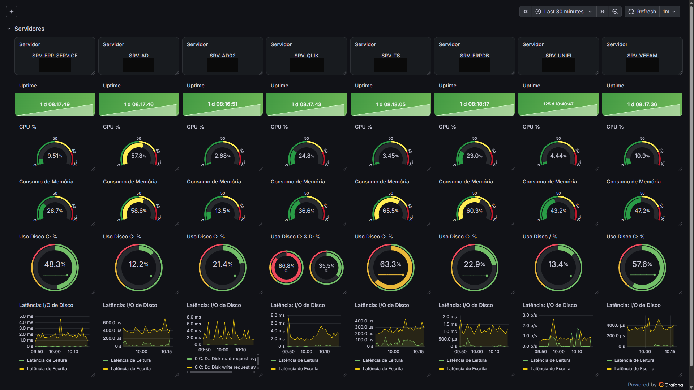

# Painel de Monitoramento de Infraestrutura de Servidores
> [!WARNING]
> **OpSec Disclaimer:** Este repositório demonstra a arquitetura e a lógica de um ambiente de produção ativo. Por questões de Operational Security (OpSec), todos os endereços IPs, nomes de hosts e identificadores específicos de rede foram sanitizados e substituídos por nomenclaturas fictícias (ex: `SRV-ERP-SERVICE`, `SRV-AD`).

## O Problema Resolvido

A estabilidade de qualquer operação depende diretamente da saúde da infraestrutura que a sustenta. Manter servidores críticos (Active Directory, ERP, bancos de dados, virtualização e backup) espalhados em uma rede corporativa invariavelmente cria pontos cegos de observabilidade. O problema crítico surge quando um servidor sofre degradação de recursos silenciosamente: alta utilização de CPU, esgotamento de memória ou disco cheio comprometem serviços essenciais antes que a equipe de infraestrutura perceba. Este projeto foi desenvolvido para atacar essa "dor" operacional, unificando a visibilidade de múltiplos servidores em um único painel e garantindo que qualquer degradação seja identificada de forma imediata e visual.

## Foco Tático em NOC

Este dashboard possui um propósito tático estrito de NOC (Network Operations Center), atuando como a fundação essencial da observabilidade da infraestrutura. O objetivo primário é garantir e monitorar a disponibilidade e a performance dos servidores que sustentam as operações do negócio. O foco analítico recai sobre a saúde dos ativos: utilização de CPU, consumo de memória, uso de disco (por partição, quando aplicável) e a latência de I/O de disco, além do Uptime contínuo de cada servidor monitorado.

## Detalhamento do Processo Técnico (Data Flow)

A arquitetura foi estruturada para garantir visibilidade contínua e centralizada, seguindo um Data Flow consolidado:

1. **Coleta Local:** Em cada servidor monitorado (Active Directory, ERP, banco de dados, Qlik, Terminal Services, UniFi e Veeam), um Zabbix Agent roda de forma nativa, coletando telemetria de sistema operacional, desempenho de disco e disponibilidade de serviços.
2. **Transporte:** Os dados coletados pelos agentes são enviados de forma segura, através da rede interna, diretamente ao servidor central do Zabbix, sem exposição desnecessária de portas de gerência.
3. **Agregação e Alerta:** O servidor central do Zabbix processa a telemetria recebida, armazenando o histórico e aplicando Thresholds operacionais para detectar falhas, degradações de performance e indisponibilidade.
4. **Visualização:** O Grafana consome essas métricas de forma contínua via API do Zabbix, centralizando o monitoramento operacional. Utilizando painéis nativos (gauges, stats e séries temporais) para máxima performance, o dashboard consolida a telemetria visual de todos os servidores em uma única tela, permitindo triagem tática rápida.

## Componentes da Arquitetura

* **Data Visualization & Analytics:** Grafana
* **Monitoring & Alerting:** Zabbix Server & Zabbix Agents
* **Infrastructure:** Servidores Windows/Linux (Active Directory, ERP, Banco de Dados, Qlik, Terminal Services, UniFi, Veeam)

## Dashboard Highlights

* **Dynamic Thresholds:** Métricas de CPU, memória e disco alteram suas cores autonomamente (verde, amarelo, vermelho) com base na severidade definida, permitindo aos operadores de NOC detectarem degradações de forma visual e imediata.
* **Visibilidade Granular por Servidor:** Painéis isolados para cada servidor (ex: `SRV-AD`, `SRV-ERPDB`, `SRV-VEEAM`), exibindo IP, Uptime, CPU, memória, uso de disco e latência de I/O individualmente, permitindo correlação rápida entre consumo de recursos e estabilidade do serviço.
* **Uptime Contínuo:** Indicador dedicado por servidor, facilitando a identificação imediata de reinicializações inesperadas ou indisponibilidades recentes.
* **Latência de I/O de Disco:** Séries temporais de latência de leitura e escrita por servidor, essenciais para diagnóstico de gargalos de performance em bancos de dados e serviços de arquivo.
* **Atualização Automática:** Painel configurado com refresh automático (1 minuto) e janela de tempo deslizante (últimos 30 minutos), garantindo dados sempre atualizados para a operação.
